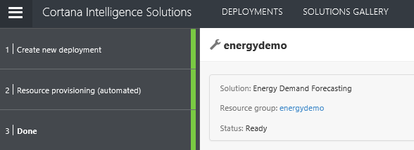
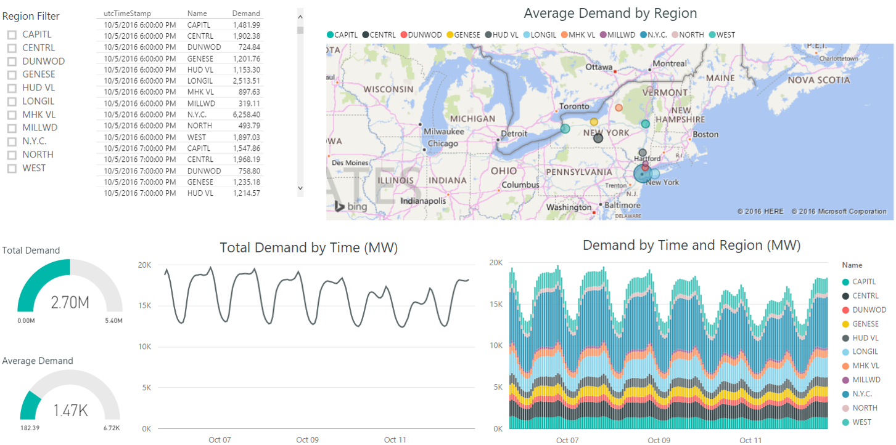
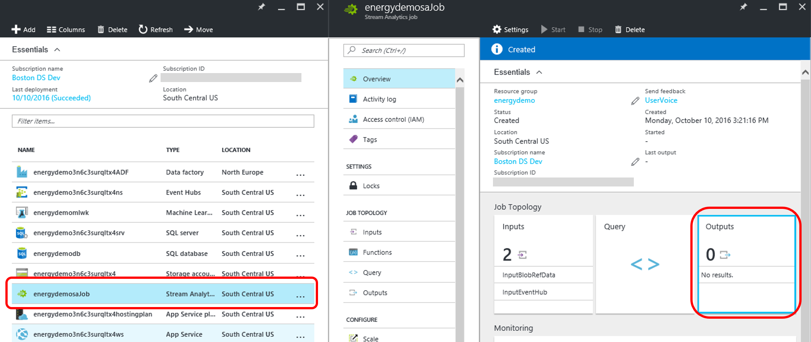

# [Quality Assurance for Manufacturing](https://go.microsoft.com/fwlink/?linkid=831187)

This document is focusing on the post deployment instructions for the automated deployment through [Cortana Intelligence Solutions](https://gallery.cortanaintelligence.com/solutions). The source code of the solution as well as manual deployment instructions can be found [here](https://github.com/Azure/cortana-intelligence-energy-demand-forecasting/tree/master/Manual%20Deployment%20Guide).

# Architecture
The architecture diagram shows various Azure services that are deployed by [Quality Assurance for Manufacturing Solution](https://cloud.githubusercontent.com/assets/16708375/20932195/acb87330-bbcb-11e6-8a89-27d8b6e17bdf.png) using [Cortana Intelligence Solutions](https://gallery.cortanaintelligence.com/solutions), and how they are connected to each other in the end to end solution.

1.	The Manufacturing Assembly Line simulation data is streamed by the newly deployed **Azure Web Jobs**. 

2.	This synthetic data feeds into the **Azure Event Hubs** as data points/events, that will be consumed in the rest of the solution flow and stored in **Azure SQL Data Warehouse**.

3.	There are 2 **Azure Stream Analytics** jobs used in this pattern to provide near real-time analytics on the input stream from the **Azure Event Hub**. Both jobs filter through the input data and pass the data points along to a **Azure Machine Learning** endpoint sending the results to a **Power BI Dashboard**.

4.	Finally, **Power BI** is used for results visualization.
</Guide>

All the resources listed above besides Power BI are already deployed in your subscription. The following instructions will guide you on how to monitor things that you have deployed and create visualizations in Power BI.

# Post Deployment Instructions
Once the solution is deployed to the subscription, you can see the services deployed by clicking the resource group name on the final deployment screen in the CIS.

This will show all the resources under this resource groups on [Azure management portal](https://portal.azure.com/).

After successful deployment, the entire solution is automatically started on cloud. You can monitor the progress from the following resources.

## **Monitor progress**

1. Web Jobs
	
	The production line data is generated by an Azure Web Job (of type Continuous). You can monitor this web job [here]({Outputs.webJobLogsUrl}).
		
2. Azure Event Hub
	    
    Azure Event Hub receives all of the events sent by the continuous web job. You can monitor the hub activity by logging into the Azure Portal, locating the service bus namespace {Outputs.namespaceName} and finding 
	the event hub {Outputs.ingestEventHubName}.
	
3. ML WebService
	
    Five machine learning models are deployed as Azure WebServices and are consumed by the Azure Stream Analytics job.
	
	* You can view your machine learning web services by going [here](https://studio.azureml.net) and in the machine learning workspace {Outputs.mlWorkspaceId}.
	

## **Visualization**
Power BI dashboard can be used to visualize the real-time failure predictions. The following instructions will guide you to build a dashboard to visualize data from database and from real-time data stream.

### Visualize Energy Data from Database

The essential goal of this part is to get the demand forecast of each region and visualize it. Power BI can directly connect to an Azure SQL database as its data source, where the prediction results are stored.

> Note:  1) In this step, the prerequisite is to download and install the free software [Power BI desktop](https://powerbi.microsoft.com/desktop). 2) We recommend you start this process 2-3 hours after you deploy the solution so that you have more data points to visualize.

1.  Get the database credentials.

    You can find your database and server name on the page when you finish your deployment. The SQL username and password will be the ones you choose in the beginning of the deployment.

2.	Update the data source of the Power BI file
  -  Make sure you have installed the latest version of [Power BI desktop](https://powerbi.microsoft.com/desktop).

  -	In this GitHub repository, you can download the **'EnergyDemandForecastSolution.pbix'** file under the folder **'Power BI'** and then open it. **Note:** If you see an error massage, please make sure you have installed the latest version of Power BI Desktop.

  - On the top of the file, click **‘Edit Queries’** drop down menu. Then choose **'Data Source Settings'**.
  

  - In the pop out window, click **'Change Source'**, then replace the **"Server"** and **"Database"** with	your own server and database names and click **"OK"**. For server name, make sure you specify the port 1433 in the end of your server string
  (**YourSolutionName.database.windows.net, 1433**). After you finish editing, close the 'Data Source Settings' window.

  - On the top of the screen, you will see a message. Click **'Apply Changes'**. A new window will pop out and ask for database credentials. Click **'Database'** on the left of the window, enter your SQL credentials. For ***'Select which level to apply these settings to'***, choose the second one with database name. Then click ***'Connect'***.

  - Now the dashboard is updated to connect to your database. In the backend, model is scheduled to be refreshed every 1 hour. You can click **'Refresh'** button on the top to get the latest visualization as time moving forward.

3. (Optional) Publish the dashboard to [Power BI online](http://www.powerbi.com/).
    Note that this step needs a Power BI account (or Office 365 account).

      - Click **"Publish"** on the top panel. Choose **'My Workspace'** and few seconds later a window appears displaying "Publishing succeeded".

      - Click the link on the screen to open it in a browser. On the left panel, go to the **Dataset** section, right click the dataset *'EnergyDemandForecastSolution'*, choose **Dataset Settings**. In the pop out window, click **Enter credentials** and enter your database credentials by following the instructions. To find detailed instructions, please see [Publish from Power BI Desktop](https://support.powerbi.com/knowledgebase/articles/461278-publish-from-power-bi-desktop).

      - Now you can see new items showing under 'Reports' and 'Datasets'. To create a new dashboard: click the **'+'** sign next to the
        **Dashboards** section on the left pane. Enter the name "Energy Demand Forecasting Demo" for this new dashboard.

      - Once you open the report, click    to pin all the
		visualizations to your dashboard. To find detailed instructions, see [Pin a tile to a Power BI dashboard from a report](https://support.powerbi.com/knowledgebase/articles/430323-pin-a-tile-to-a-power-bi-dashboard-from-a-report). Here is an example of the dashboard.

      

### Visualize Energy Data From Real-time Data Stream

The essential goal of this part is to visualize the real-time energy consumption data. Power BI can connect to a real-time data stream through Azure Stream Analytics.

> Note: A [Power BI online](http://www.powerbi.com/) account is required to perform the following steps. If you don't have an account, you can [create one here](https://powerbi.microsoft.com/pricing).

1.  Add Power BI output in Azure Stream Analytics (ASA).

  - Navigate to [Azure management portal](https://portal.azure.com) and login with your username and password. On the left tab click ***Resource groups*** and search for the solution you just deployed. The name of the resource group is the same as the name you choose for the solution.

  - Click your resource group and locate the stream analytics job. The name of the job should be: YourSolutionName+"saJob" (i.e. energydemosaJob). Click the Stream Analytics job and then click **'Outputs'** from the panel on the right.

    

  - On the new window, click **'+Add'** on the top, and then it will show a window asking for information of the output. Under **'Sink'**, choose **'Power BI'**, then click **'Authorize'**. In the pop out window, log in with your Power BI account.

  - Once you successfully authorize your Power BI account, fill in other information as follows. Set the **Output Alias** as **'outputPBI'**. Set your **'Dataset Name'** and **'Table Name'** as **'EnergyForecastStreamData'**. Click **'Create'** once you finish.

  - Now you have added the Power BI output, you can click  at the top of the page to start the Stream Analytics job. You will get a confirmation message (e.g. 'Streaming Job started successfully').

  - For other details, you can refer to the instructions in [Azure Stream Analytics & Power BI: A real-time analytics dashboard for real-time visibility of streaming data](https://azure.microsoft.com/en-us/documentation/articles/stream-analytics-power-bi-dashboard/).

2. Login on [Power BI online](http://www.powerbi.com)

    -   On the left panel Datasets section in My Workspace, you should be able to see a new dataset showing on the left panel of Power BI. This is the streaming data you pushed from Azure Stream Analytics in the previous step.

    -   Make sure the ***Visualizations*** pane is open and is shown on the
    right side of the screen.

3. Now you can directly create a visualization on Power BI online. We will use this example to show you how to create the "Demand by Timestamp" tile:
	-	Click dataset **EnergyForecastStreamData** on the left panel Datasets section.

	-	Click **"Line Chart"** icon.

	-	Click EnergyForecastStreamData in **Fields** panel.

	-	Click **“time”** and make sure it shows under "Axis". Click **“demand”** and make sure it shows under "Values".

	-	Click **'Save'** on the top and name the report as “EnergyStreamDataReport”. The report named “EnergyStreamDataReport” will be shown in Reports section in the Navigator pane on left.

	-	Click **“Pin Visual”** icon on top right corner of this line chart, a "Pin to Dashboard" window may show up for you to choose a dashboard. Please select "EnergyStreamDataReport", then click "Pin".

## **Customization**

This solution receives a fairly significant amount of data from the generating application. That data is used to call an Azure Machine Learning experiment for a prediction, which is then saved to a Power BI dataset, but the raw data is disregarded.

In a real-world scenario, this raw incoming data would be typically be saved for a number of reasons.

The following steps will guide you in setting up a raw data dump to Azure Storage of that raw data by creating the services to stream raw events to Azure Storage using date and time partitions.  

***NOTE*** This extension has no effect on how the demo works and is included to give the reader some hands on experience to stream data to storage from an Azure Event Hub

### Extension steps
 - Log into the [Azure Management Portal](https://ms.portal.azure.com) 
 - In the left hand menu select *Resource groups*
 - Locate the resource group  you created for this project and click on it displaying the resources associated with the group in the resource group blade
 - Locate the Azure Service Bus ({Outputs.namespaceName}) and then under Event Hubs click on {Outputs.ingestEventHubName}
 - Click on *Consumer Groups* and then __+Add consumer...__
 - Enter the name __extensionGroup__, then click __Create__. 
 - Close the Event Hub and Service Bus blades to view the Resource Group
 - At the top of the Resource Group blade click __+Add__.
 - In the *Search Everything* search box enter ***Stream Analytics job***
 - Choose ***Stream Analytics job*** from the results then click *Create*
 - Enter ***manufactureExtension*** as the name and choose the subscription, resource group and location for this solution.
 - Click *Create* and then close the blades until the *Resource groups* blade is visible. You may need to use the __Refresh__ button at the top of the blade. 
 - Click on the ***manufactureExtension*** job.
 - Click *Inputs* and then the __+Add__ button
    - Input Alias: InputHub
	- Source Type: Data Stream
	- Source: Event Hub
	- Subscription: Use event hub from current subscription
	- Service bus namespace: {Outputs.namespaceName}
	- Event hub name: {Outputs.ingestEventHubName}
	- Event hub policy name: RootManageSharedAccessKey
	- Event hub consumer group: extensionGroup
	- Event serialization format: JSON
	- Encoding: UTF-8 
	- Click __Create__
 - Click *Ouputs* and then the __+Add__ button
    - Output Alias: OutputBlob
	- Sink: Blob storage
	- Subscription: Use event hub from current subscription
	- Storage account: {Outputs.storageAccountName}
	- Storage account key: Provided for you
	- Container: Create new container
	- Container*(Name): rawevents (all lower case)
	- Event hub consumer group: extensionGroup
	- Path pattern: {date}/{time}
	- Date format: YYYY-MM-DD
	- Time format: HH
	- Event serialization format: JSON
	- Encoding: UTF-8 
	- Format: Line separated
	- Click __Create__
- Click *Query*
    - Modify the query to: SELECT * INTO OutputBlob FROM InputHub 
    - Click *SAVE*
	- Close the Query blade
	- Click __Start__ on the Stream Analytics job blade
	  - Job output start time __Now__
	  - Click __Start__
